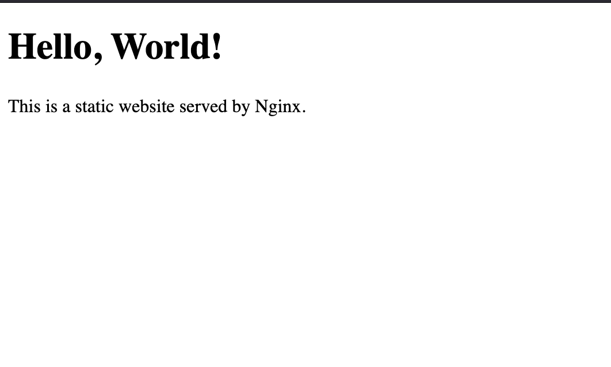

# Static Website Deployment with Nginx and Docker

This project demonstrates how to deploy a simple static website using **Nginx** and **Docker**. The static website is served by Nginx inside a Docker container, making it easy to deploy and scale across different environments.

## Table of Contents

- [Overview](#overview)
- [Prerequisites](#prerequisites)
- [Installation](#installation)
- [Usage](#usage)
- [Docker Commands](#docker-commands)


## Overview

This project uses:
- **Nginx**: A high-performance web server to serve the static website.
- **Docker**: A containerization platform to package the website and its dependencies.

The static website consists of a simple `index.html` file that displays a "Hello, World!" message.

### `index.html`

This is the static HTML file that will be served by Nginx. You can modify this file to change the content of your website.

### `Dockerfile`

The `Dockerfile` defines how the Docker image is built. It uses the official Nginx image (`nginx:alpine`) and copies the `index.html` file into the appropriate directory inside the container.

## Prerequisites

Before you begin, ensure you have the following installed on your system:

- [Docker](https://www.docker.com/get-started) (version 20 or higher)
- A basic understanding of Docker and containers

## Installation

1. Clone this repository to your local machine:

    ```
    git clone https://github.com/akintunero/my-demo-website.git
    cd my-demo-website
    ```

2. Create the `Dockerfile`:

    ```
    FROM nginx:alpine
    COPY index.html /usr/share/nginx/html/index.html
    EXPOSE 80
    ```

3. Create the `index.html` file:

    ```
    <!DOCTYPE html>
    <html lang="en">
    <head>
        <meta charset="UTF-8">
        <meta name="viewport" content="width=device-width, initial-scale=1.0">
        <title>Static Website</title>
    </head>
    <body>
        <h1>Hello, World!</h1>
        <p>This is a static website served by Nginx.</p>
    </body>
    </html>
    ```

4. Build the Docker image:

    ```
    docker build -t my-demo-website .
    ```

5. Run the Docker container:

    ```
    docker run -d -p 8080:80 my-demo-website
    ```

6. Access the website by navigating to [http://localhost:8080](http://localhost:8080) in your web browser (or `http://<your-ip>:8080` if running on a remote server).


## Usage

Once the container is running, you can access your static website at [http://localhost:8080](http://localhost:8080). To modify the content of the website, simply edit the `index.html` file and rebuild the Docker image.



## Docker Commands

Here are some useful Docker commands for managing your container:

- **Build the Docker Image**:

    ```
    docker build -t my-demo-website .
    ```

- **Run the Container**:

    ```
    docker run -d -p 8080:80 my-demo-website
    ```

- **List Running Containers**:

    ```
    docker ps
    ```

- **Stop a Running Container**:

    ```
    docker stop <container_id>
    ```

- **Remove a Stopped Container**:

    ```
    docker rm <container_id>
    ```

- **View Docker Images**:

    ```
    docker images
    ```